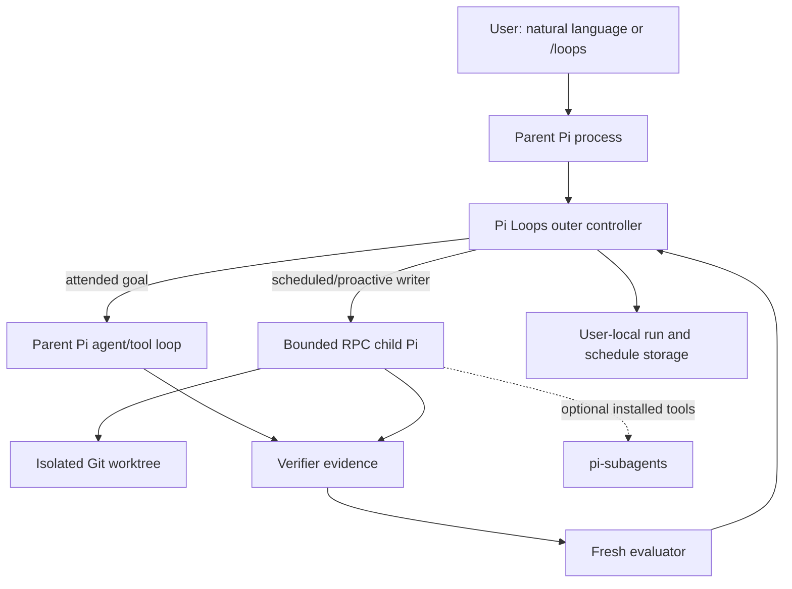

# Pi Loops — Product and Architecture Design Brief

**Status:** Approved for implementation on 2026-07-12  
**Repository:** <https://github.com/Naees/pi-loops>  
**Planned npm package:** `@naees/pi-loops`  
**License:** MIT

This is an internal design document. Production code, tests, packaging, and runtime behavior must never depend on `.project-design/`. The entire directory must be removed before the first public release.

## 1. Product brief

Pi Loops is a Pi-native package for controlling repeated coding-agent work while Pi is running.

It covers four related loop modes:

1. **Turn-based:** Pi's normal agent loop, strengthened by explicit verification guidance.
2. **Goal-based:** Repeat bounded work cycles until declared completion criteria are independently accepted.
3. **Time-based:** Start goals at one-off or recurring times while Pi is running.
4. **Proactive:** Start goals from filesystem events, Pi extension events, or the model-facing trigger interface.

### Target users

- Developers already using Pi for medium or large coding tasks.
- Teams performing migrations, refactors, iterative verification, and greenfield development.
- Users who want unattended local work without installing a daemon or hosted service.

### Non-goals

Pi Loops will not:

- Run after Pi exits.
- Install a daemon or cloud service.
- Replace Pi's permission system.
- Implement provider authentication or secret management.
- Bundle vendor-specific GitHub, Slack, CI, or webhook integrations.
- Become a general multi-agent framework.
- Reimplement `pi-subagents`.
- Automatically merge unattended code.
- Guarantee a monetary spending cap when a provider does not expose reliable cost information.

## 2. Zero-setup contract

After:

```text
pi install npm:@naees/pi-loops
```

the package works without package-specific configuration, assuming:

- Pi is installed and running.
- A usable model/provider is authenticated.
- The project is trusted.
- Pi has the permissions required by the task.
- Git is available for unattended writing workflows.
- The publisher controls the `@naees` npm scope.

`pi-subagents` is optional but highly recommended for large parallel tasks:

```text
pi install npm:pi-subagents
```

Its absence never blocks normal Pi Loops operation.

Closing Pi stops all active execution. Saved schedule definitions reactivate when Pi next runs in their project, but missed occurrences are discarded.

## 3. First-60-seconds journey

```text
$ pi install npm:@naees/pi-loops
$ cd my-project
$ pi
```

The user can type naturally:

```text
Keep fixing the authentication implementation until the auth tests pass.
Do not modify the tests.
```

Or invoke the explicit command:

```text
/loops goal Fix authentication until `npm test -- auth` passes.
Do not modify existing auth tests.
```

Pi Loops:

1. Interprets the goal.
2. Inspects available project scripts and tests.
3. Displays the inferred completion contract.
4. Starts immediately if the contract is clear.
5. Runs bounded work cycles.
6. Collects verifier evidence from normal Pi tool executions.
7. Evaluates completion in fresh context.
8. Repeats or stops with an explicit reason.

On first substantial use, it may display once:

```text
Pi Loops works without additional packages.
For parallel workers and independent subagent reviews, pi-subagents is recommended:
pi install npm:pi-subagents
```

## 4. User stories and acceptance criteria

### Goal loop

**Story:** As a developer, I can declare a measurable goal and let Pi iterate without prompting every step.

**Acceptance criteria:**

- Explicit user criteria override inferred criteria.
- Inferred criteria are visible.
- Required deterministic checks cannot be overruled by the evaluator.
- Completion requires both verifier success and evaluator acceptance.
- The default run is bounded.
- Every terminal outcome includes a reason and available evidence.

### Scheduling

**Story:** As a developer, I can schedule work while Pi remains open.

```text
/loops schedule every 30m -- check CI and address failures
/loops schedule at 14:00 -- run release-readiness checks
/loops schedule in 2h -- recheck the deployment
```

**Acceptance criteria:**

- Natural expressions are normalized and shown before saving.
- Recurring schedules have a five-minute minimum.
- Schedules are project-bound.
- Missed occurrences are not replayed.
- Overlapping occurrences coalesce into one pending run.
- No schedule fires while Pi is closed.

### Proactive work

**Story:** Other Pi extensions or filesystem events can trigger a bounded goal.

**Acceptance criteria:**

- Events pass through a documented, namespaced contract.
- Events are debounced and coalesced.
- No vendor credentials or polling are built into Pi Loops.
- Event-triggered writers follow the same isolation and budget rules as schedules.

### Recovery

**Story:** I can recover interrupted or stalled work.

**Acceptance criteria:**

- Parent or child process interruption produces `interrupted`.
- `/loops resume` resumes directly when exactly one run qualifies.
- Multiple eligible runs produce a selector.
- Resume reuses the branch, worktree, session, and run ID.
- Resume requires a new finite budget for stalled or exhausted runs.

### Cleanup

**Story:** Pi Loops does not accumulate unlimited run storage.

**Acceptance criteria:**

- At most 50 terminal runs are retained per project.
- The least recently used eligible run is removed when the limit is exceeded.
- Deletion removes its ID, run record, evidence, logs, and Pi Loops-managed child-session data.
- No Pi Loops runtime tombstone remains. The supported API cannot erase commands, messages, or concise custom entries already present in the append-only parent Pi transcript; Pi Loops never edits session JSONL directly.
- Active, interrupted, queued, or unresolved-worktree runs are not automatically removed.
- Project code branches are not disposable runtime storage.

## 5. Public interface

### Slash command

```text
/loops goal <goal>
/loops schedule <time-expression> -- <goal>
/loops status [run-id|schedule-id]
/loops stop [run-id]
/loops resume [run-id]
/loops watch ...
/loops clean [filters]
/loops delete <run-id>
```

If `/loops resume` is unambiguous, no ID is required.

### Model-facing tool

The tool is named `pi_loops` and exposes workflow-only actions:

```text
goal
schedule
status
stop
resume
trigger
```

It does not act as a shell, permission manager, deployment tool, or general task runner.

### Skill

The `pi-loops` skill teaches the model:

- When to use goal versus schedule semantics.
- How to formulate measurable completion criteria.
- How to surface deterministic evidence.
- How to await delegated work.
- How to call `pi_loops`.
- Not to claim completion with outstanding asynchronous work.

### Namespacing

| Resource | Name |
|---|---|
| Slash command | `/loops` |
| Tool | `pi_loops` |
| Skill | `pi-loops` |
| Session custom entries | `pi-loops.*` |
| Event bus | `pi-loops:*` |
| Branches | `pi-loops/<run-id>` |
| Internal environment variables | `PI_LOOPS_*` |
| Configuration schema | `pi-loops.config.v1` |
| Run schema | `pi-loops.run.v1` |

Pi command provenance and collisions are inspected through `pi.getCommands()`. Tool availability and provenance are inspected through `pi.getAllTools()`.

## 6. Default control profile

### Confirmed medium-work defaults

| Limit | Default |
|---|---:|
| Active wall time | 3 hours |
| Outer work cycles | 15 |
| Equivalent no-progress cycles | 3 |
| Concurrent writers per repository | 1 |
| Evaluators per cycle | 1 |
| Pending occurrence per schedule | 1, coalesced |
| Recurring schedule minimum | 5 minutes |
| Child recursion depth | 1 internal worker level |
| Retained terminal runs | 50 per project |

Every run must have finite cycle and time bounds. Invocation-level overrides may increase them, but never make them unlimited.

### Calibration to validate before release

- Up to 40 Pi turns within one child work cycle.
- Up to 500 observed tool completions per run.
- Optional token ceiling when Pi exposes complete usage.
- Cost reporting without claiming an enforceable monetary cap.

These are provisional implementation calibration values, not yet a public compatibility promise.

## 7. Layered architecture



### Responsibility by layer

| Layer | Stop owner | Counters/state | Cancellation | Recovery |
|---|---|---|---|---|
| Pi agent/tool loop | Pi and working model | Pi session, turns, tools, usage | `ctx.abort()` or RPC `abort` | Pi retry/compaction behavior |
| Pi Loops outer controller | Deterministic controller | Cycles, active wall time, stall signatures, state machine | `/loops stop`, shutdown handler | Persisted run record and explicit resume |
| Optional `pi-subagents` children | `pi-subagents` | Its budgets, child state, and artifacts | Its own control surface | Its own resume rules; parent must await visible work |

Pi Loops will not attempt to control hidden internals of another extension.

## 8. Execution architecture

### Attended goals

Attended goals use the current parent Pi session and current working tree.

A cycle begins when Pi Loops sends or follows up with a bounded work instruction. It ends at `agent_settled`, after Pi finishes retries, compaction retries, and queued continuation messages.

### Scheduled and proactive writers

Unattended writers:

1. Acquire the repository writer lease.
2. Require a clean Git repository.
3. Create a namespaced branch and isolated worktree.
4. Start the current Pi executable in documented RPC mode.
5. Send prompts through JSON stdin, never shell interpolation.
6. Observe structured events from stdout.
7. Reuse the same child session across cycles.
8. Abort and terminate the child on cancellation or shutdown.
9. Leave successful code on a review branch.
10. Never merge automatically.

The runner is private and narrowly scoped. It does not expose general chains, fan-out, arbitrary agent definitions, or nested child orchestration.

### Process lifecycle

```text
preflight
→ create branch/worktree
→ spawn RPC child
→ handshake
→ send goal
→ observe agent_settled
→ verify
→ evaluate
→ feedback/retry OR finalize
→ stop child
→ remove clean worktree
→ retain branch
→ completed
```

Cancellation escalation:

```text
RPC abort
→ wait
→ close stdin
→ normal termination
→ wait
→ force termination
```

A child-mode recursion guard prevents Pi Loops from launching another Pi Loops child. A child-side absolute deadline protects against parent failure.

### Safe process-management contract

Before starting, the controller verifies the writer lease, Git state, selected model, finite budget, and completion contract. It then:

- Resolves the current Pi installation rather than trusting a later arbitrary PATH entry.
- Uses an argument array with `shell: false`.
- Sends task content through RPC stdin so it is not exposed in process arguments.
- Does not log environment variables or provider credentials.
- Uses `PI_LOOPS_CHILD` and a run token to enter non-recursive worker mode.
- Tracks PID plus an ownership token; PID alone is never trusted.
- Bounds RPC stdout/stderr and rejects malformed protocol messages.
- Relays interactive RPC requests when a parent UI is available.
- Never treats silence as approval.
- Marks a run stopped only after the process exits.

On parent failure, attached pipes, a child-side absolute deadline, and startup reconciliation prevent indefinite work. The Phase 0 spike must prove the no-orphan guarantee on every claimed operating system.

### Finalization

A successful unattended writing run must have:

- Passing required verification.
- Evaluator acceptance.
- No visible outstanding delegated work.
- Changes committed to the namespaced branch.
- A clean worktree.

Pi Loops then gracefully stops the child, removes the clean worktree, releases the writer lease, retains the code branch, and marks the run completed.

If commit creation, hooks, or Git identity require input, the run enters `awaiting_user`. Failed, stalled, and interrupted runs preserve their worktree and session for recovery. Such unresolved runs are not eligible for automatic retention eviction.

## 9. Augmented evaluation

### Example completion contract

```text
Goal:
- Correct authentication expiration behavior.

Required verifier:
- `npm test -- auth` exits 0.

Constraint:
- Existing auth tests are unchanged.

Judgment:
- The implementation fixes the defect rather than bypassing validation.

Limits:
- 15 cycles.
- 3 active hours.
```

### Evidence collection

Pi Loops relies on Pi's existing permission behavior. Arbitrary verifier commands execute through the normal Pi agent/tool path. Pi Loops observes their structured results; it does not silently execute user-provided shell verifiers outside Pi's tool flow.

If a required verifier was not run, the next cycle asks the worker to run it. Missing evidence is not success.

### Decision precedence

1. Required deterministic check failed → incomplete.
2. Required check missing → incomplete.
3. Deterministic checks passed but evaluator rejected → incomplete.
4. Deterministic checks passed and evaluator accepted → complete.
5. Verifier unavailable → explicit verification failure or `awaiting_user`.
6. Same effective failure three times → `stalled`.
7. Limit reached → `budget_exhausted`.
8. Cancellation wins over a late evaluator result.

### Evaluator

The evaluator:

- Uses the currently selected authenticated Pi model by default.
- Runs in fresh context.
- Receives the goal, constraints, worker summary, structured verifier evidence, and relevant change summary.
- Does not receive private chain-of-thought.
- Cannot call tools.
- Returns a strict result such as:

```json
{
  "complete": false,
  "needsUser": false,
  "reason": "Two required tests still fail.",
  "failedCriteria": ["npm test -- auth exits 0"],
  "feedback": "Investigate refresh-token expiration handling."
}
```

## 10. State machine

### Run states

```text
configuring
preflight
queued
starting
running
verifying
evaluating
finalizing
awaiting_user
completed
failed
cancelled
budget_exhausted
stalled
interrupted
```

### Transitions

| From | To | Guard or cause |
|---|---|---|
| `configuring` | `preflight` | Completion contract is sufficiently clear |
| `configuring` | `awaiting_user` | Material ambiguity remains |
| `preflight` | `queued` | Writer lease is occupied |
| `preflight` | `starting` | Preconditions and writer lease pass |
| `preflight` | `awaiting_user` | Dirty/non-Git project blocks unattended writing |
| `preflight` | `failed` | Unrecoverable configuration or storage error |
| `queued` | `starting` | Writer lease becomes available |
| `queued` | `cancelled` | User cancels |
| `starting` | `running` | Parent or child handshake succeeds |
| `starting` | `failed` | Process/worktree/session initialization fails |
| `running` | `verifying` | Pi emits `agent_settled` |
| `running` | `awaiting_user` | Worker needs context or RPC input |
| `running` | `interrupted` | Parent exits, process crashes, or connection is lost |
| `running` | `cancelled` | User stops run |
| `running` | `failed` | Nonrecoverable execution error |
| `verifying` | `evaluating` | Required objective evidence passes |
| `verifying` | `running` | Evidence fails or is missing and budget remains |
| `verifying` | `stalled` | No-progress threshold reached |
| `verifying` | `budget_exhausted` | Cycle or time limit reached |
| `evaluating` | `finalizing` | Evaluator accepts |
| `evaluating` | `running` | Evaluator rejects and budget remains |
| `evaluating` | `awaiting_user` | Evaluator requires human information |
| `evaluating` | `stalled` | Equivalent rejection threshold reached |
| `evaluating` | `budget_exhausted` | Limit reached |
| `evaluating` | `failed` | Evaluator repeatedly fails technically |
| `finalizing` | `completed` | Branch is reviewable and worktree is clean |
| `finalizing` | `awaiting_user` | Commit/hook/Git issue requires input |
| `awaiting_user` | `preflight` | User resolves a preflight condition |
| `awaiting_user` | `running` | User supplies execution guidance |
| `awaiting_user` | `cancelled` | User cancels |
| `interrupted` | `preflight` | Explicit resume |
| `stalled` | `preflight` | Resume with revised guidance and fresh budget |
| `budget_exhausted` | `preflight` | Resume with a new finite budget |
| recoverable `failed` | `preflight` | Explicit resume after cause is resolved |

`completed` and `cancelled` are not resumed; rerunning creates a new run ID.

### Schedule states

```text
enabled
running
pending_coalesced
paused
deleted
```

Only one occurrence per schedule may run or wait. Further triggers merge into the pending occurrence.

## 11. Identity, persistence, and storage

### IDs

Every execution receives a stable run ID such as `run_a4f2`. Every persisted schedule receives a schedule ID such as `schedule_7c21`. An ID is an index key, not a storage path.

### Logical user-local storage

```text
~/.pi/agent/pi-loops/
├── config.json
├── projects/
│   └── <stable-project-key>/
│       ├── project.json
│       ├── schedules/
│       ├── runs/
│       ├── sessions/
│       ├── worktrees/
│       └── locks/
└── notices.json
```

The exact base-directory derivation must be validated against Pi's supported configuration environment before implementation.

Project identity uses the canonical project root plus a stable hash, never the basename alone.

### Run schema

```json
{
  "schemaVersion": 1,
  "runId": "run_a4f2",
  "projectId": "project_hash",
  "scheduleId": null,
  "mode": "goal",
  "state": "running",
  "goal": {},
  "budget": {},
  "budgetEpochs": [],
  "cycle": 3,
  "timestamps": {},
  "evidence": [],
  "evaluation": [],
  "usage": {},
  "worker": {},
  "branch": null,
  "worktree": null,
  "terminalReason": null
}
```

### Storage rules

- Atomic replace for state snapshots.
- Append-only transition journal where useful.
- Per-project lease prevents duplicate writers.
- Lease includes an ownership token; PID alone is insufficient.
- Startup changes stale `running` states to `interrupted`.
- No environment snapshots, API keys, or model chain-of-thought.
- Verifier output is bounded and truncated.
- Detailed output is not duplicated unnecessarily.

### Retention

- Keep at most 50 eligible terminal runs per project.
- Recent completion, status access, or export updates recency.
- Remove the least recently used eligible record completely.
- No tombstone and no pinning in v1.
- Schedules persist until explicitly deleted.
- Runs with unresolved worktrees are ineligible for automatic deletion.
- Project branches are never removed by runtime-record eviction.

## 12. Configuration

### Precedence

```text
Invocation
→ project config
→ user config
→ built-in defaults
```

### Proposed files

```text
User:    ~/.pi/agent/pi-loops/config.json
Project: <project>/.pi/pi-loops.json
```

The project file is optional and never created automatically.

### Initial schema

```json
{
  "schemaVersion": 1,
  "defaults": {
    "maxCycles": 15,
    "maxActiveMs": 10800000,
    "stallThreshold": 3
  },
  "scheduling": {
    "minimumRecurringMs": 300000
  },
  "retention": {
    "terminalRunsPerProject": 50
  },
  "evaluator": {
    "model": "current"
  }
}
```

Invalid configuration fails clearly and does not silently fall back for safety-critical limits.

## 13. Optional `pi-subagents` strategy

### Decision

- Not bundled.
- Not required.
- Highly recommended.
- No source-path imports.
- No direct execution adapter in v1.
- No fork or vendored code.

The package may inspect `pi.getAllTools()` to detect a configured `subagent` tool and display informational capability status. Registry inspection is not executable access.

If the working agent uses `pi-subagents`, it must await delegated work before claiming completion. Visible outstanding work causes evaluator rejection. Hidden background state cannot be deterministically controlled without a future supported interoperability contract.

### Rationale

Current evidence indicates that `pi-subagents`:

- Registers `subagent` and `wait`.
- Supports budgets, acceptance, worktrees, async control, artifacts, chains, and recursion limits.
- Has no public `main` or `exports` entry point.
- Would risk duplicate tools, commands, timers, and state if another extension copy were bundled.
- Cannot be called through `pi.getAllTools()`, which exposes metadata but not `execute`.

### Compatibility policy

- Document known-compatible versions.
- Never require private source layout.
- Detect and report presence without changing behavior.
- Reconsider direct integration only if upstream publishes a supported bridge/API.

## 14. Alternatives

### Parent session only

**Advantage:** Minimal code and no child process.  
**Rejected:** Scheduled work would interrupt the active conversation and modify the active checkout.

### Require or bundle `pi-subagents`

**Advantage:** Existing child execution, worktrees, budgets, and async control.  
**Rejected:** Requiring it breaks the one-install core experience. Bundling risks duplicate registration, unsupported coupling, and update/licensing burden.

### Embedded Pi SDK session

**Advantage:** Avoids a subprocess and can construct a cwd-bound session.  
**Tradeoff:** Weaker fault isolation and more responsibility for reproducing the user's effective Pi runtime.  
**Status:** Credible fallback only if the RPC child spike fails.

### Chosen approach

Parent-native controller plus a narrowly scoped RPC child for isolated unattended writers. This best balances one-install behavior, supported Pi surfaces, process isolation, and strict scope.

## 15. Package manifest strategy

Proposed shape:

```json
{
  "name": "@naees/pi-loops",
  "version": "0.1.0",
  "license": "MIT",
  "type": "module",
  "engines": {
    "node": ">=22.19.0"
  },
  "keywords": [
    "pi-package",
    "pi",
    "agent",
    "loops",
    "loop-engineering"
  ],
  "files": [
    "src/",
    "skills/",
    "README.md",
    "LICENSE",
    "CHANGELOG.md"
  ],
  "pi": {
    "extensions": ["./src/extension/index.ts"],
    "skills": ["./skills"]
  },
  "peerDependencies": {
    "@earendil-works/pi-coding-agent": "*",
    "@earendil-works/pi-ai": "*",
    "typebox": "*"
  }
}
```

### Compatibility baseline

- Initial validated Pi baseline: `0.80.6`.
- Initial Node baseline: `>=22.19.0`, matching the inspected Pi package.
- Pi core imports remain peers as required by Pi package documentation.
- Avoid runtime dependencies unless a demonstrated need justifies one.
- Do not claim OS support until RPC cancellation and process-tree tests pass there.

## 16. Proposed repository tree

```text
.
├── package.json
├── package-lock.json
├── tsconfig.json
├── README.md
├── LICENSE
├── CHANGELOG.md
├── SECURITY.md
├── CONTRIBUTING.md
├── src/
│   ├── extension/index.ts
│   ├── commands/loops-command.ts
│   ├── tools/pi-loops-tool.ts
│   ├── controller/{controller,state-machine,budgets,no-progress}.ts
│   ├── contracts/{completion-contract,inference}.ts
│   ├── evidence/{collector,verifier,evaluator}.ts
│   ├── scheduler/{parser,scheduler,coalescing}.ts
│   ├── triggers/{event-bus,filesystem}.ts
│   ├── worker/{rpc-runner,rpc-jsonl,watchdog,process-control,worktree}.ts
│   ├── storage/{store,atomic-file,lease,retention,migration}.ts
│   ├── config/{schema,load}.ts
│   ├── ui/{status,selectors}.ts
│   └── shared/{errors,ids,types}.ts
├── skills/pi-loops/SKILL.md
├── tests/{unit,integration,rpc,e2e,security,compatibility,fixtures}/
├── scripts/{inspect-pack,release-check,clean-home-e2e,security-check}.mjs
└── .github/workflows/{ci,compatibility,security,release}.yml
```

Each module has one primary responsibility. State transitions and schemas remain independent of Pi UI code.

## 17. `.project-design` organization and release rule

```text
.project-design/
├── brief/product-design.md
├── decisions/
├── research/
├── diagrams/
├── plans/
├── spikes/
└── release/
```

Rules:

- Every internal brief, ADR, research note, diagram, plan, spike report, and readiness report belongs here.
- Production code and tests never read it.
- The npm `files` whitelist excludes it.
- Before public release, transfer user-facing material into public docs and remove `.project-design/` entirely.
- Release must fail if `.project-design/` exists in the release checkout or npm tarball.
- Release must also fail if generated `.pi-subagents/` artifacts appear.

## 18. Testing strategy

### Unit tests

- State transitions and invalid transitions.
- Budget accounting and resume budget epochs.
- No-progress signatures.
- Schedule parsing and minimum cadence.
- Coalescing and duplicate triggers.
- Run/schedule IDs.
- Configuration precedence and schema migration.
- Atomic storage and retention ordering.
- Complete deletion after the 50-run cap.
- Strict RPC JSONL framing, including Unicode line separators.
- Output truncation.
- Evaluator result validation.

### Integration tests

- Extension command and tool registration.
- Natural-language skill-to-tool flow.
- `agent_settled` cycle handling.
- Evidence captured from standard Pi tool events.
- Fresh evaluator calls with mocked providers.
- Project/user configuration precedence.
- Multiple Pi processes competing for one writer lease.
- Session shutdown and reload cleanup.
- Filesystem trigger debounce.
- Event-bus trigger contract.

### RPC worker tests

- Startup and handshake.
- Prompt delivery through stdin.
- Correct cwd and model.
- Recursion guard.
- Graceful completion.
- Abort during model streaming and tool execution.
- Parent `SIGINT`, `SIGTERM`, and forced death.
- Child deadline after parent loss.
- Descendant-process cleanup.
- Resume with existing session/worktree.
- Commit failure and `awaiting_user`.
- Malformed or oversized RPC output.
- No prompt text in process arguments.

### Packed end-to-end tests

From an npm tarball and isolated Pi home:

- One-install first goal.
- Natural-language and explicit invocation.
- Passing and failing verification.
- Evaluator accept/reject.
- Stall detection.
- Budget exhaustion and resume.
- Cancellation.
- One-off and recurring schedules.
- Missed schedule discard.
- Trigger coalescing.
- Dirty and non-Git behavior.
- Successful review branch.
- Crash cleanup.
- Retention after 51 terminal runs.
- Optional `pi-subagents` absent and present.
- Existing unrelated `pi-loops` package installed.
- Duplicate `/loops` diagnostics.

### Compatibility

- Minimum supported and latest Pi.
- Node 22 LTS and newer supported versions.
- macOS, Linux, and Windows before claiming each platform.
- Relevant TUI, RPC, JSON, and print behavior.
- Global and project package installation.
- Upgrade and state-schema migration.

## 19. Security and production-readiness plan

Security is continuous, with a comprehensive final audit.

### Design controls

- No shell interpolation.
- RPC JSON over pipes.
- Fixed process-executable resolution.
- Bounded output.
- Atomic state writes.
- Ownership-token leases.
- Recursion guard.
- Independent child deadline.
- No stored environment snapshots or credentials.
- No automatic permission approval.
- No automatic merge.
- No vendor network listener.
- Minimal dependencies.
- Package-content whitelist.

### Final comprehensive review

- Threat model parent, child, storage, Git, event bus, and evaluator boundaries.
- Dependency and supply-chain audit.
- Static analysis and secret scanning.
- Path traversal and symlink tests.
- Command-injection tests.
- Malicious RPC-framing tests.
- Event-payload validation and fuzzing.
- Race and stale-lock testing.
- Process-orphan and process-tree tests.
- Storage-permission review.
- Tarball inspection.
- License inventory and SBOM.
- Clean-machine install and uninstall.
- Manual source review of process and filesystem boundaries.

Production release is blocked by unresolved critical/high vulnerabilities or an unproven no-orphan guarantee.

## 20. Milestones

### Phase 0 — Foundation and mandatory spikes

Deliver Git setup, `.project-design`, package skeleton, RPC worker spike, storage/lease spike, evaluator spike, and packed-install harness.

Exit when child startup, cancellation, parent-death handling, resume, recursion prevention, and no-shell-interpolation are proven.

### Phase 1 — Turn and goal loops

Deliver `/loops goal`, status, stop, resume, `pi_loops`, the skill, completion contracts, evidence, evaluator, budgets, persistence, stall detection, and cleanup.

Exit when packed one-install goal tests pass without `pi-subagents`, recovery paths pass, and phase-boundary refactoring is complete.

### Phase 2 — Scheduling

Deliver one-off/recurring schedules, project binding, coalescing, worktree/RPC execution, review branches, and restart behavior.

Exit when missed runs are discarded, writers never overlap, shutdown stops workers, dirty/non-Git behavior matches the contract, and phase review passes.

### Phase 3 — Proactive triggers

Deliver filesystem triggers, shared event-bus contract, model-facing triggers, validation, debounce, and coalescing.

Exit when trigger storms cannot overlap writers, hostile payload tests pass, and no vendor integration has entered core.

### Phase 4 — Production hardening and release

Deliver compatibility testing, migrations, budget calibration, comprehensive security audit, public docs, release automation, and `.project-design/` removal.

Exit when CI and real-session tests pass, no critical/high security findings remain, the tarball contains only intended files, clean installation passes, and npm publishing access is confirmed.

Each phase includes readability, duplication, architecture, documentation, and security review before the next begins.

## 21. Evidence

- Claude loop taxonomy: <https://claude.com/blog/getting-started-with-loops>
- Claude goal evaluation: <https://code.claude.com/docs/en/goal>
- Claude routines and scheduling: <https://code.claude.com/docs/en/routines>
- Claude dynamic workflows: <https://code.claude.com/docs/en/workflows#orchestrate-subagents-at-scale-with-dynamic-workflows>
- Anthropic agent design guidance: <https://www.anthropic.com/engineering/building-effective-agents>
- Pi packages: <https://pi.dev/docs/latest/packages>
- Pi extensions: <https://pi.dev/docs/latest/extensions>
- Pi RPC mode: <https://pi.dev/docs/latest/rpc>
- Pi session format: <https://pi.dev/docs/latest/session-format>
- `pi-subagents` manifest: <https://github.com/nicobailon/pi-subagents/blob/c940fe20e86d9ba429eebcac809ec79d478ef206/package.json#L1-L70>
- `pi-subagents` tool registration: <https://github.com/nicobailon/pi-subagents/blob/c940fe20e86d9ba429eebcac809ec79d478ef206/src/extension/index.ts#L315-L407>
- `pi-subagents` schemas: <https://github.com/nicobailon/pi-subagents/blob/c940fe20e86d9ba429eebcac809ec79d478ef206/src/extension/schemas.ts#L27-L180>
- Existing npm-name collision: <https://www.npmjs.com/package/pi-loops>

Validated during design on 2026-07-12 against Pi `0.80.6` and Node `25.1.0`. Pi `0.80.6` declares Node `>=22.19.0`.

## 22. Complete decision record

### Confirmed constraints

- **C-001:** No implementation before the exact approval phrase.
- **C-002:** Execution exists only while Pi runs.
- **C-003:** Refactor and improve at every phase boundary.
- **C-004:** Final output must meet production standards and pass comprehensive security review.
- **C-005:** Scope is loop workflow; unrelated permissions, integrations, and policy belong to Pi or other packages.
- **C-006:** Internal design material lives only in `.project-design/` and is removed before release.
- **C-007:** Zero setup assumes authenticated, trusted, and permissioned Pi.
- **C-008:** Production code, tests, and packaging never depend on `.project-design/`.

### Decisions

- **D-001:** Natural language plus one slash command — combines discovery with deterministic invocation.
- **D-002:** Pi-native zero setup, not standalone — closing Pi stops work.
- **D-003:** Cover the complete Claude loop family — deliver it in phases.
- **D-004:** Use `schedule` terminology — do not imply Claude cloud persistence.
- **D-005:** All execution occurs only while Pi runs — no daemon.
- **D-006:** Augmented deterministic-plus-model evaluation — objective checks take precedence.
- **D-007:** Deliver incrementally — later modes build on controller safety.
- **D-008:** Phase order is turn/goal, schedule, proactive.
- **D-009:** Persist schedules, reactivate with Pi, discard missed occurrences.
- **D-010:** Coalesce overlapping occurrences.
- **D-011:** Attended work may use the current tree; unattended writers use worktrees.
- **D-012:** Rely on Pi permission behavior; add no package permission framework.
- **D-013:** Default to 3 hours, 15 cycles, and 3 no-progress cycles.
- **D-014:** Keep `pi-subagents` optional but highly recommended.
- **D-015:** Require the parent worker to await delegated work.
- **D-016:** Use one `/loops` command with subcommands.
- **D-017:** Show one dismissible `pi-subagents` recommendation.
- **D-018:** Interrupted runs require explicit resume.
- **D-019:** Resume directly when unambiguous; otherwise show a selector.
- **D-020:** Permit one active writer per repository.
- **D-021:** Store runtime state user-locally with concise Pi-session mirrors.
- **D-022:** Retain 50 terminal runs per project by recent use.
- **D-023:** Eviction removes the complete Pi Loops runtime record and ID with no runtime tombstone; append-only parent Pi transcript history and project code are outside this deletion boundary (clarified by ADR-006).
- **D-024:** Use explicit criteria first, then visible project inference.
- **D-025:** Stall and exhaustion are recoverable with new guidance and finite budget.
- **D-026:** Use the current selected model for fresh evaluation.
- **D-027:** Support natural schedules with normalized display and five-minute recurring minimum.
- **D-028:** Bind schedules to their creating project.
- **D-029:** Use generic proactive triggers; leave vendor adapters external.
- **D-030:** Publish as `@naees/pi-loops`, subject to npm-scope access.
- **D-031:** Use the MIT license.
- **D-032:** Support optional user/project configuration with invocation-first precedence.
- **D-033:** Use a minimal RPC Pi child for isolated unattended writers.
- **D-034:** Leave unattended output on review branches; never auto-merge.
- **D-035:** Dirty/non-Git projects block unattended writing, not attended/read-only work.
- **D-036:** Supervise children with RPC abort, deadlines, escalation, recursion guard, and startup reconciliation.

### Assumptions requiring validation

- **A-001:** The publisher controls or can create the `@naees` npm scope.
- **A-002:** The current Pi executable can be resolved reliably across installation modes.
- **A-003:** RPC shutdown supports a demonstrable no-orphan guarantee.
- **A-004:** The current model can be called independently for evaluation with existing authentication.
- **A-005:** Permission/UI requests can be relayed correctly over RPC.
- **A-006:** Worktree finalization can create a reviewable branch without bypassing user policy.
- **A-007:** Shared `pi.events` is sufficient for generic in-process trigger integrations.
- **A-008:** The proposed user-local storage base is acceptable across supported Pi installations.
- **A-009:** Cross-platform process-tree cancellation can meet production requirements.
- **A-010:** Initial budget calibration is appropriate for medium projects.

### Open technical spikes

- **Q-001:** Resolve the current Pi executable in npm and standalone/binary installs.
- **Q-002:** Validate grace periods and process-tree termination per operating system.
- **Q-003:** Validate the extension-data base directory.
- **Q-004:** Calibrate turn, tool, token, and time budgets on realistic migrations.
- **Q-005:** Handle commit hooks and missing Git identity during finalization.
- **Q-006:** Detect visible outstanding async work from optional packages.
- **Q-007:** Establish minimum/latest Pi compatibility beyond `0.80.6`.

### Risks and mitigations

- **R-001:** Users may interpret schedules as always-on. Mitigate with explicit "while Pi runs" UX.
- **R-002:** Child or descendant survives parent death. Mitigate with RPC abort, attached pipes, watchdog deadline, process-tree tests, and a release gate.
- **R-003:** Evaluator falsely accepts or rejects. Deterministic checks take precedence and evidence remains visible.
- **R-004:** Verifier logs contain sensitive output. Minimize, truncate, avoid environment capture, and use user-local permissions.
- **R-005:** Multiple Pi processes fire one schedule. Use ownership-token leases and coalescing.
- **R-006:** Optional child work remains hidden. Use skill guidance, evaluator checks, and document the limitation.
- **R-007:** Git behavior varies. Use strict preflight, preserve unresolved worktrees, and never auto-merge.
- **R-008:** Pi APIs evolve. Use minimum versions, compatibility CI, and API-focused tests.
- **R-009:** Medium defaults may consume substantial usage. Keep finite bounds, status reporting, cancellation, and no-progress stopping.
- **R-010:** Saved old IDs become invalid after eviction. Document the 50-run policy and offer explicit evidence export later.
- **R-011:** npm scope cannot be published. Verify early and choose a distinct unscoped fallback if necessary.
- **R-012:** Internal documents enter the tarball. Use a `files` whitelist and release-tree/tarball gates.

### Rejected or deferred alternatives

- **X-001:** Goal-only product — rejected for the complete phased family.
- **X-002:** Run pinning — deferred as scope expansion.
- **X-003:** Cloud or daemon execution — conflicts with the runtime boundary.
- **X-004:** Bundled `pi-subagents` — collision and coupling risk.
- **X-005:** Required `pi-subagents` — violates one-install core behavior.
- **X-006:** Automatic merge — unsafe for unattended work.
- **X-007:** Unattended writes in the active tree — conflict risk.
- **X-008:** Vendor-specific adapters — outside core workflow scope.
- **X-009:** Retention tombstones — complete deletion was selected.
- **X-010:** Required configuration — violates zero setup.
- **X-011:** Additional permission framework — duplicates Pi.
- **X-012:** Replay missed schedules — stale-work burst risk.
- **X-013:** Concurrent repository writers — nondeterministic.
- **X-014:** Directory-copy isolation for non-Git projects — unreliable integration base.
- **X-015:** npm name `pi-loops` — already owned by another publisher.

### Evidence record

- **E-001 [Verified]:** Claude distinguishes turn-, goal-, time-, and proactive-loop families.
- **E-002 [Verified]:** Claude `/goal` uses a separate post-turn evaluator.
- **E-003 [Verified]:** Claude `/loop` is local while `/schedule` creates managed routines.
- **E-004 [Verified]:** Pi packages expose resources through `package.json#pi`.
- **E-005 [Verified]:** Included Pi packages must be bundled and referenced through `node_modules` paths.
- **E-006 [Verified]:** Pi exposes lifecycle events, commands, tools, messages, persistence, abort, and `agent_settled`.
- **E-007 [Verified]:** `getAllTools()` exposes metadata/provenance, not another tool's executor.
- **E-008 [Verified]:** Pi RPC exposes JSONL prompt, abort, event, state, usage, and session control.
- **E-009 [Verified]:** Pi custom session entries persist without entering model context.
- **E-010 [Verified]:** `pi-subagents` has no public `main` or `exports`.
- **E-011 [Verified]:** `pi-subagents` supports relevant budgets, worktrees, acceptance, and async orchestration.
- **E-012 [Verified]:** The unscoped npm name `pi-loops` is occupied.
- **E-013 [Verified]:** The supplied GitHub repository had no commits during design; the local directory was not yet its checkout.
- **E-014 [Inference]:** Parent plus RPC child is the smallest design satisfying one-install, isolation, and optional-subagent decisions; Phase 0 must validate it.
